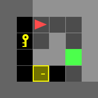
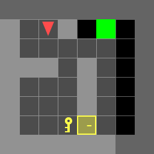
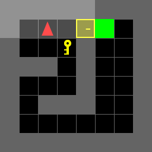

# Autonomous Navigation in a Door & Key environment using Dynamic Programming

## Project Overview

This repository contains the implementation of an autonomous navigation system that utilizes Dynamic Programming to navigate an environment with doors and keys. The primary goal is to guide an agent from its initial location to a desired destination while minimizing the cost of its actions, including unlocking doors and picking up keys. The project leverages the concept of Markov Decision Processes (MDP) and utilizes the Value Iteration algorithm to generate an optimal policy for efficient navigation.

## Features

- **Dynamic Programming:** Utilizes the Dynamic Programming approach to solve motion planning problems in an environment with doors and keys.

- **Markov Decision Process (MDP):** Models the environment as an MDP, including state space, control space, state transitions, and associated costs.

- **Value Iteration Algorithm:** Implements the Value Iteration algorithm to compute an optimal policy for navigation.

## Project File Structure

### Datasets

### Known Map Environment

The *Known Map* scenario involves 7 predefined environments provided in the [known_envs](Code/envs/known_envs) folder. These environments have known configurations, and the project requires computing different control policies for each environment and evaluating their performance. 

|           doorkey-5x5-normal            |
| :-------------------------------------: |
|  |

|           doorkey-6x6-normal            |            doorkey-6x6-direct            |            doorkey-6x6-shortcut            |
| :-------------------------------------: | :--------------------------------------: | :----------------------------------------: |
|  |  |  |

|           doorkey-8x8-normal            |            doorkey-8x8-direct            |            doorkey-8x8-shortcut            |
| :-------------------------------------: | :--------------------------------------: | :----------------------------------------: |
|  |  |  |


### Random Map Environment

The "Random Map" scenario involves 36 random 8x8 environments. Here are some key features of these environments:

- Grid Size: 8x8
- Perimeter: Surrounded by walls
- Doors: Two doors at specific locations that can be open or locked
- Key: Randomly located in one of three positions
- Goal: Randomly located in one of three positions
- Agent Initial Position: (3, 5) facing up

The random maps are designed to test the algorithm's ability to generalize to new and unseen environments.


### Source Code

#### Necessary Python Libraries

The third party modules used are as listed below. They are included as [`requirements.txt`](Code/requirements.txt).

- numpy
- matplotlib
- minigrid
- imageio


Python files

- [utils_partA.py](Code/partA/utils_partA.py) and [utils_partB.py](Code/partB/utils_partB.py) - Python files contains some useful helper tools for known and random     environments:
    - **step()**: Move your agent
    - **generate_random_env()**: Generate a random environment for debugging
    - **load_env()**: Load the test environments
    - **save_env()**: Save the environment for reproducing results
    - **plot_env()**: For a quick visualization of your current env, including: agent, key, door, and the goal
    - **draw_gif_from_seq()**: Draw and save a gif image from a given action sequence.

- [doorkey_partA.py](Code/partA/doorkey_partA.py) - Python file containing necessary functions to solve the Dynamic Programming in *7 KNOWN* environments
- [doorkey_partB.py](Code/partB/doorkey_partB.py) - Python file containing necessary functions to solve the Dynamic Programming in *36 RANDOM* environments


## How to run the code

1. Install Python version `3.7 ~ 3.10`

2. Install all required libraries -

```
pip install -r requirements.txt

```

### Steps to Run the Code - Part A (Known Environment)

1. Specify the path of the known environment in the *path_env* variable within the [doorkey_partA.py](Code/partA/doorkey_partA.py) file. The known environment files are present in [known_envs](Code/envs/known_envs) folder.

2. Specify the path where you want to save the GIF file in the *path_gif* variable within the same [doorkey_partA.py](Code/partA/doorkey_partA.py) file.

3. Run the Python file [doorkey_partA.py](Code/partA/doorkey_partA.py) using one of the following methods:

   - In the terminal, use the following command:
     ```bash
     python doorkey_partA.py
     ```

   - Alternatively, open the file in an integrated development environment like VSCode and click on the Run button.

4. Output: The code will print the optimal action sequence for the corresponding map and create a GIF file.

### Steps to Run the Code - Part B (Random Environment)

Since all the random environments are 8x8 Doorkey maps, follow these steps:

1. Specify the value of the variable *i* in the [doorkey_partB.py](Code/partB/doorkey_partB.py) file, indicating the map number in the file name. For example, if the file name is 'Doorkey-8x8-1.env', set the value of *i* to 1. If the file name is 'Doorkey-8x8-2.env', set *i* to 2, and so on. The random environment files are present in [random_envs](Code/envs/random_envs) folder.

2. Specify the path of the random environment in the *path_env* variable within the [doorkey_partB.py](Code/partB/doorkey_partB.py) file.

3. Specify the path where you want to save the GIF file in the *path_gif* variable within the same [doorkey_partB.py](Code/partB/doorkey_partB.py) file.

4. Run the Python file [doorkey_partB.py](Code/partB/doorkey_partB.py) using one of the following methods:

   - In the terminal, use the following command:
     ```bash
     python doorkey_partB.py
     ```

   - Alternatively, open the file in an integrated development environment like VSCode and click on the Run button.

5. Output: The code will print the optimal action sequence for the corresponding map and create a GIF file.


## Results

Algorithm has been applied to all the 7 Known environments and the results of 2 known environments are: 

|doorkey-6x6-normal|doorkey-8x8-normal|
|---|---|
|||
### RANDOM Environments

Algorithm has been applied to all the 36 Random environments and the results of 2 Random environments are: 

|DoorKey-8x8-24|DoorKey-8x8-12|
|---|---|
||| 


## Conclusion

This project showcases the use of Dynamic Programming to solve autonomous navigation problems in environments with doors and keys. It highlights the algorithm's effectiveness in navigating through different environments with varying complexities and its potential to generalize to new and unseen environments.

## Keywords

- Dynamic Programming
- Markov Decision Process
- Value Iteration Algorithm
- Optimal Policy
- Autonomous Navigation

**Contributing:**

Contributions to this project are welcome! If you have any suggestions, find issues, or want to contribute code, please feel free to open an issue or submit a pull request.


